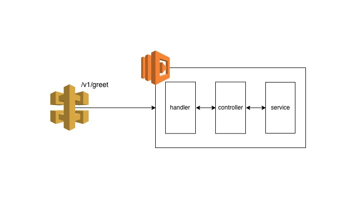

# Example Typescript Inversify Lambda App

Example lambda app to prototype Dependency Injection in TypeScript.

## Prerequisites

You will need:

* Node.js (v12.3.1 used) <https://nodejs.org/en/>
* Yarn (v1.16.0 used) <https://yarnpkg.com>
* Command Prompt

## Scripts

To download all dependencies, run `yarn install`.

To run the tests and view code coverage report, run `yarn test`

To generate a lambda zip artefact, run `yarn build`

## Architecture

This example application to prototype TypeScript & Dependency Injection comprises of many programming languages, frameworks, etc. to build, test and deploy the application.

### Diagram

A high level architecture can be seen below

### Technology

The application is written using:

* TypeScript (<https://www.typescriptlang.org/>)

#### Unit Testing

The following testing frameworks were used for unit testing:

* Jest (<https://jestjs.io/>)
* TS-Jest (<https://github.com/kulshekhar/ts-jest>)

#### Build Tools

To create a artefact, the following build tools are used:

* Babel (<https://babeljs.io/>)
* Webpack (<https://webpack.js.org/>)

#### Infrastructure

The application is currently designed to run on Amazon Web Service (AWS). The application uses the following AWS services:

* API Gateway (<https://aws.amazon.com/api-gateway/>)
* Lambda (<https://aws.amazon.com/lambda/>)
* Cloudwatch (<https://aws.amazon.com/cloudwatch/>)
* IAM (<https://aws.amazon.com/iam/>)

#### Infrastructure as Code

To be able to deploy all of the AWS infrastrcture, the following IaC tools are used:

* Terraform (<https://www.terraform.io/>)
* Terragrunt (<https://github.com/gruntwork-io/terragrunt>)

#### Infrastructure Testing

To test the AWS infrastructure that is provisioned, the following programmming language and framework is used:

* Golang (<https://golang.org/>)
* Terratest (<https://github.com/gruntwork-io/terratest>)

## Terraform

This module will provision and confifure a API Gateway and lambda function.

**NOTE:** This module requries Terraform 0.12

### Terraform Docs

#### Inputs

| Name | Description | Type | Default | Required |
|------|-------------|:----:|:-----:|:-----:|
| bucket\_name | Name of Bucket where artefacts are stored | string | n/a | yes |
| log\_retention | Max duration to retain cloudwatch logs | string | `"14"` | no |
| tags | AWS tags to be applied to resources | map | n/a | yes |
| zip\_key | ZIP file name | string | n/a | yes |

### Outputs

| Name | Description |
|------|-------------|
| invoke\_url | The URL to invoke an API stage |

## Terratests

To test the Terraform infrastructure and modules, Terratest <https://github.com/gruntwork-io/terratest> is used.

The tests are written in Go and can be seen in the test folder in each Terraform module directory.

Terragrunt is run/ excute Terraform code and commands against real AWS infrastructure

The Terratest are designed to test the terraform modules and code on the following infrastructure

* AWS

### Terratest Prerequisites

In addition to the prerequistes above, you also need:

* Terraform (v0.12.2 used) <https://www.terraform.io/>
* Terragrunt (v0.19.2 used) <https://github.com/gruntwork-io/terragrunt>
* Golang (v1.12.6 used) <https://golang.org/>
* AWS CLI <https://aws.amazon.com/cli/>

### Running Terratests

To run the terratests for a given Terraform module, please run the following commands

* Create Lambda Artefact by running the script above
* Change into the desired module directory i.e. `cd modules/lambda/test`
* Change into the test directory
* Run `go test`

**NOTE:** Go modules are being used. Running `go test` will download all of the necessary dependencies

## Postman Tests

To test the end 2 end solution, Postman is used.

The Postman Scripts can be seen in the postman-scripts folder

### Running Postman Tests via GUI

To run the postman scripts via the Postman GUI.

#### Prerequisites

In addition to the prerequistes above, you also need:

* Postman <https://www.getpostman.com>

Setup

* Import the lambda collection (found within the postman-scripts folder)
* Configure Environment to run the tests against (Add Variable URL and set the initial value as the API Gateway URL)

To run an individual script/ request

* Click on script/ request you wan to run
* Click Send Request
* Verify Tests Results

Alternatively you can use the Postman Collection Runner.

* Open Collection Runner
* Select the imported lambda collection
* Select the environment
* Click Start Run
* Verify Tests Results

### Running Postman Tests via CLI

To run the postman scripts via the CLI, Newman test runner is used. To run the Newman tests, please run the following command

`yarn newman run postman-scripts/lambda.collection.json --env-var "URL=<<API_GATEWAY_URL>>" -r cli`

For more information on Postman, see <https://www.getpostman.com/>

For more information on Newman, see <https://github.com/postmanlabs/newman>

### Terratests & Newman

Instructions coming soon

## Deploying to AWS

Instructions coming soon
