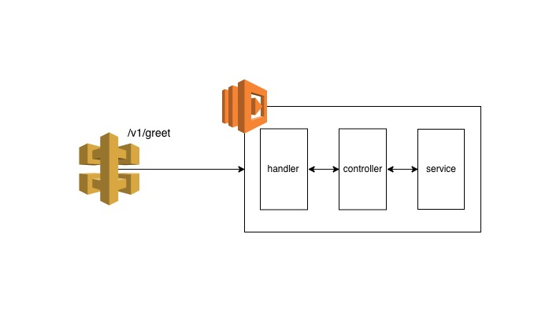

# @rjpearson94/lambda

This example application to prototype TypeScript & Dependency Injection comprises many programming languages, frameworks, etc. to build, test and deploy the application.

The application is currently designed to run on Amazon Web Service (AWS). The application uses the following AWS services:

- [API Gateway](https://aws.amazon.com/api-gateway/)
- [Lambda](https://aws.amazon.com/lambda/)
- [Cloudwatch](https://aws.amazon.com/cloudwatch/)
- [IAM](https://aws.amazon.com/iam/)
- [X-Ray](https://aws.amazon.com/xray/)

A high-level architecture can be seen below



The lambda function can be deployed using the following tools:

- [Terraform](https://www.terraform.io/)
- [CDK for Terraform](https://github.com/hashicorp/terraform-cdk)
- [CDK](https://aws.amazon.com/cdk/)

## Getting Started

To be able to build and test you need the following:

- [Yarn 2/ Berry](https://yarnpkg.com/)

## Scripts

- test (Run all tests)
- test:unit (Run unit tests & generate coverage report)
- build (Builds lambda zip)

For the full script list please see the [package.json](./package.json)

The scripts can be run using the following

Open a command prompt in this directory and run

```sh
yarn install
yarn <script>
```

## Deploying to AWS

As mentioned above the lambda can be deployed to AWS using various Infrastructure as Code (IaC) tools.

To deploy the lambda function using Terraform visit the [Terraform Infrastructure folder](./infrastructure/terraform) for more details

To deploy the lambda function using CDK for Terraform visit the [CDKTF Infrastructure folder](./infrastructure/cdktf) for more details

To deploy the lambda function using CDK visit the [CDK Infrastructure folder](./infrastructure/cdktf) for more details

**NOTE:** Please be aware cost/ charges may be incurred from deploying this lambda (and supporting resources) onto AWS

## Postman

To test the solution including the API, Postman can be used.

The Postman Scripts can be seen in the postman-scripts folder

### Running Postman Tests via GUI

To run the postman scripts via the Postman GUI.

Setup

- Import the lambda collection (found within the postman-scripts folder)
- Import the environment configuration and set the `URL` and `ApiKey` initial values

To run an individual script/ request

- Click on the script/ request you wan to run
- Click Send Request
- Verify Tests Results

Alternatively, you can use the Postman Collection Runner.

- Open Collection Runner
- Select the imported lambda collection
- Select the environment
- Click Start Run
- Verify Tests Results

### Running Postman Tests via CLI

To run the postman scripts via the CLI, Newman test runner is used. To run the Newman tests, please run the following command

`yarn newman run postman-scripts/lambda.collection.json --env-var "URL=<<API_GATEWAY_URL>>" -r cli`

**NOTE:** These postman tests are run as part of the E2E tests

For more information on Postman, see <https://www.getpostman.com/>

For more information on Newman, see <https://github.com/postmanlabs/newman>
